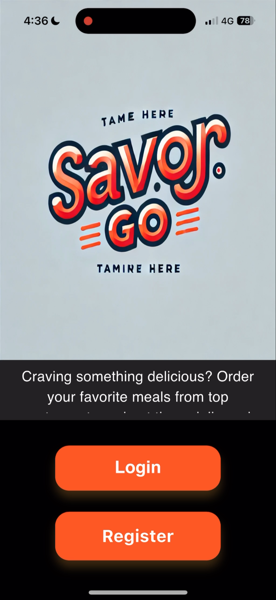
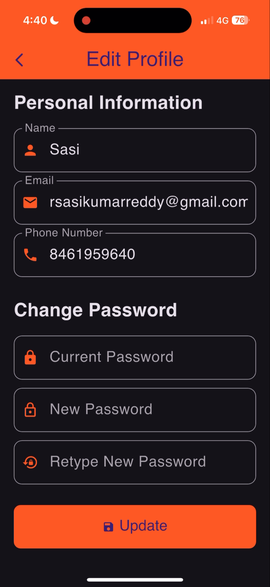

---

# 🍽️ SavorGo – Food Delivery App

**A modern food delivery management system built using Flutter (Frontend), Flask (Backend), and Oracle Database**  
**🚩 Exclusively Serving: Chennai, India**

---

## 🚀 Overview

SavorGo is a seamless and user-friendly food delivery application tailored specifically for users in Chennai. The app integrates real-time location selection, efficient restaurant filtering, secure payments, and live order tracking—all wrapped in a modern Flutter interface and powered by a Flask backend with an Oracle-based relational database.

---

## 🧩 Tech Stack

*   **Frontend**: Flutter (Dart)
*   **Backend**: Flask (Python)
*   **Database**: Oracle SQL
*   **Maps & Routing**: OpenStreetMap + OpenRouteService API
*   **Payments**: Razorpay (Sandbox)
*   **Authentication & Emailing**: SMTP for verification/invoices
*   **Cloud Deployment**: Amazon EC2 ( Ubuntu ) 

---

## 📱 Features & Flow

### 🟢 First Page

*   Users can choose to **Login** or **Register**.
*   Branded with a custom **SavorGo logo** for a personalized experience.

---

### 🔐 Authentication

#### Login

*   Requires **email** and **password**.
*   Validates against registered credentials.

#### Register

User must enter:

*   Name
*   Email
*   Phone number
*   Password

Sends a **verification email** upon successful registration.

---

### 📍 Location Picker

After logging in, users must set their delivery location via:

1.  **Current device location**
2.  **Pinpoint on map** (OpenStreetMap)

Location and address are saved and used for restaurant filtering.

---

### 🏠 Home Page

Users can navigate to:

*   **Search Restaurants**
*   **View Orders**
*   **Cart**
*   **Account/Profile**

---

### 🍽️ Restaurants

Restaurants are filtered within a **7 km delivery radius**.

Sorting is based on:

*   **Shortest distance**
*   **Highest average rating**

Features:

*   Search by restaurant name
*   Change delivery location
*   Tap to view menu and items

---

### 📋 Menu Items

View dishes from selected restaurants

Each item includes:

*   Description
*   Price
*   Add/Remove buttons

❗ Note: Users can order from **one restaurant at a time**

---

### 🛒 Cart

*   Displays added items
*   Modify item quantity
*   Proceed to **Checkout & Payments**

---

### 💳 Payments

Integrated with **Razorpay (Sandbox)**

Supports:

*   Cards
*   Netbanking
*   Wallets
*   PayLater

Users can **simulate payment success**

Email invoice sent upon completion

---

### 🧾 Invoice

Post-payment, users are redirected to an invoice page

Displays:

*   Order number
*   Itemized details
*   Quantities and prices
*   Total amount
*   Estimated delivery time

Also accessible from the **Orders** section

---

### 📦 Orders

#### 1\. Current Orders

View in-progress orders

Access invoice

Option to **track delivery agent**

**Live route tracking** from restaurant to home using:

OpenRouteService API

Simulated travel time:

*   **1.5 mins/km** (Simulation)
*   **4 mins/km** (Realistic)

\*❗ Note: Users can place multiple orders from **same or different location.**

#### 2\. Past Orders

*   View delivered orders
*   Access invoice
*   **Rate & review** items and restaurants

---

### 👤 Account/Profile

Displays:

*   Name
*   Phone number
*   Email

Options:

**Edit profile** (with password verification)

**Change password** (requires old + new password confirmation)

**Toggle theme**:

*   Light
*   Dark
*   System Default

**Logout**

---

## ✨ Unique Highlights

*   🎯 Chennai-only filtering ensures hyperlocal service.
*   📦 Real-time order simulation with estimated delivery timers.
*   📍 Accurate location handling with dual modes: current GPS or map selection.
*   🧾 Invoice and payment receipt directly sent to user email.
*   🔒 Secure and clean UI/UX with responsive design principles.

---

## 🔧 Backend – Flask + Oracle (SavorGo API)

The backend of **SavorGo** is a robust RESTful API built with **Flask (Python)** and **Oracle Database**. It handles authentication, order management, payment processing, restaurant filtering, email notifications, delivery simulation, and user management.

---

### 🧰 Tech Stack & Tools

| Component | Technology |
| --- | --- |
| Framework | Flask (Python) |
| Database | Oracle SQL |
| ORM/Driver | pyodbc |
| Environment | Python-dotenv |
| CORS Handling | flask-cors |
| Geolocation | Haversine Formula |
| Email Service | smtplib + MIME |
| Date & Time | datetime, timezone |
| Payment Gateway | Razorpay Sandbox |

---

### 📂 Key Functional Modules

#### 🔑 Authentication

*   `/register`: Registers a new user after checking for email uniqueness. Sends a **welcome email** with HTML formatting.
*   `/login`: Validates credentials and returns user details on success.

#### 📍 Location Management

*   `/add_address`: Adds or updates the delivery address for a customer.
*   Haversine distance calculation is used for all location-based features.

#### 🍽️ Restaurant & Menu

*   `/restaurants/<user_id>`: Fetches restaurants within a **7 km radius**, sorted by **distance and average rating**.
*   `/menu/<restaurant_id>`: Retrieves menu items with name, description, and price.

#### 🛒 Cart Operations

*   `/cart/add`: Adds or updates an item in the cart.
*   `/cart/remove`: Decreases item quantity or removes it.
*   `/cart/<customer_id>`: Returns full cart details with quantities and prices.

#### 🧾 Order Management

*   `/order/place`: Places an order from the cart, calculates delivery ETA based on distance, and sends a detailed **invoice via email**.
*   `/order/details/<order_id>`: Provides itemized breakdown of a specific order.
*   `/orders/<customer_id>`: Returns all orders (current and past) of a user.

#### 🛰️ Order Tracking

*   `/track_order/<order_id>`: Fetches the **restaurant and delivery address coordinates**, with the **distance and order timestamp**.
*   `/track_order/update`: Marks an order as “Delivered”.

#### 💳 Payment Integration

*   `/payment`: Simulates payment success (Razorpay Sandbox), and logs it with a unique `Payment_ID`.

#### ⭐ Review & Rating System

*   `/review`: Submits customer reviews with star ratings and optional text.
*   Used for computing **average ratings** shown in restaurant listings.

#### 👤 User Profile

*   `/customer/details/<customer_id>`: Fetches customer profile details.
*   `/customer/update/<customer_id>`: Updates name, email, phone, and password after validation.

---

### 📨 Email Integration

**SMTP Emailing** with `smtplib` and `email.mime`:

Sends a styled confirmation email on registration.

Sends **dynamic HTML invoices** after every order, including:

*   Order ID
*   Itemized table
*   Total cost
*   Estimated delivery time

---

### 🌍 Geolocation & Distance Estimation

Custom **Haversine function** used to compute distance (in km) between two coordinates.

Delivery time = `1.5 min/km (simulation)` or `4 min/km (real world)`

Used in:

*   `/invoice` for estimating delivery
*   `/track_order` for agent simulation

---

### 🔐 Security & Config

All secrets and credentials like `DB_USER`, `MAIL_USERNAME`, `SMTP_SERVER` etc. are stored securely in a `.env` file and loaded via `dotenv`.

Supports **Cross-Origin Resource Sharing (CORS)** from development IPs:

---

### 🧪 API Highlights

| Method | Route | Purpose |
| --- | --- | --- |
| POST | `/register` | Register user |
| POST | `/login` | Login and auth |
| POST | `/add_address` | Add/update address |
| GET | `/restaurants/<user_id>` | Filter restaurants by distance |
| GET | `/menu/<restaurant_id>` | Fetch restaurant menu |
| POST | `/cart/add` | Add item to cart |
| POST | `/cart/remove` | Remove item from cart |
| GET | `/cart/<customer_id>` | Fetch cart contents |
| POST | `/order/place` | Place a new order |
| GET | `/order/details/<order_id>` | Get order details |
| GET | `/orders/<customer_id>` | List all user orders |
| GET | `/track_order/<order_id>` | Get delivery coordinates |
| POST | `/track_order/update` | Mark order as delivered |
| POST | `/payment` | Process (mock) payment |
| POST | `/review` | Submit rating & review |
| GET | `/customer/details/<id>` | Get profile data |
| PUT | `/customer/update/<id>` | Update profile |

---

### ✅ Status & Future Enhancements

**Current Status**: Stable and functional for production within local network.

**Planned Improvements**:

*   JWT or OAuth-based Authentication
*   Delivery agent live tracking simulation UI
*   Admin panel for restaurant & order management
*   Dockerized deployment with NGINX reverse proxy

---

## 🗄️ Oracle Database Design

The database is a normalized relational schema built in **Oracle SQL**, designed for scalability and consistency. It includes strong foreign key constraints, cascading deletions, and sequence-driven primary key generation.

### 📊 Entity Tables & Relationships

#### 1\. `Address`

Stores geolocation data for customers, restaurants, and delivery agents.

```
Address_ID (PK), Address, Latitude, Longitude
```

#### 2\. `Customer`

Customer profile including email and phone uniqueness, and optional address linkage.

```
Customer_ID (PK), Name, Email (UNIQUE), Phone_Number (UNIQUE), Password, Address_ID (FK)
```

#### 3\. `Restaurant`

Each restaurant is linked to a unique address.

```
Restaurant_ID (PK), Restaurant_Name, Address_ID (FK, UNIQUE), Opening_Hours, Closing_Hours, Contact_Number
```

#### 4\. `Menu_Item`

Menu items belong to a restaurant.

```
Item_ID (PK), Restaurant_ID (FK), Item_Name, Description, Price
```

#### 5\. `Cart`

Temporary storage of items selected by users.

```
Cart_ID (PK), Customer_ID (FK), Item_ID (FK), Quantity
```

#### 6\. `Order_Details`

Captures the summary of an order.

```
Order_ID (PK), Customer_ID (FK), Restaurant_ID (FK), Total_Amount, Order_Status, Order_Time, Customer_Latitude, Customer_Longitude, Restaurant_Address (FK)
```

#### 7\. `Order_Item`

Line items of an order.

```
Order_Item_ID (PK), Order_ID (FK), Item_ID (FK), Quantity, Price
```

#### 8\. `Payment`

Simulates payment linked to an order.

```
Payment_ID (PK), Order_ID (FK), Payment_Status, Payment_Time
```

#### 9\. `Review`

Captures customer feedback for restaurants.

```
Review_ID (PK), Customer_ID (FK), Restaurant_ID (FK), Rating (1–5), Review_Text, Review_Date
```

#### 10\. `Delivery`

Tracks delivery status and agent’s live location.

```
Delivery_ID (PK), Order_ID (FK), Agent_Location_ID (FK), Delivery_Status, Delivery_Time
```

---

### 🔁 Sequences

*   `order_id_seq` – For generating unique `Order_ID`
*   `order_item_id_seq` – For `Order_Item_ID`
*   `cart_id_seq` – For `Cart_ID`
*   `review_seq` – For `Review_ID`

Each sequence ensures unique IDs and seamless integration with backend automation.

---

### 🧩 Schema Highlights

*   **Cascading Deletes**: Ensures referential integrity (e.g., deleting a customer clears their cart, orders, etc.).
*   **Validation Rules**: Enforced via `CHECK` constraints on rating, quantity, and order status.
*   **Scalable ID Design**: Prefixed ID formats (`CUST001`, `ORD000123`, etc.) for traceability.

---

## 🚀 Deployment

The entire backend infrastructure—Oracle Database and Flask Server—has been **deployed on an Amazon EC2 instance** for global accessibility and reliability.

### ⚙️ Key Deployment Components

**🌍 Oracle Database Hosting on EC2**  
Deployed **Oracle XE (Express Edition)** on an Amazon EC2 Linux instance, enabling **remote access to the database from anywhere** using a **public Elastic IP**. This setup ensures seamless backend-to-database communication regardless of client location.

**📌 Static IP with Elastic IP**  
Utilized **Elastic IP**, a persistent public IPv4 address provided by AWS EC2, to ensure that the server and database remain accessible even after the instance is stopped and restarted. This avoids IP reconfiguration and DNS propagation issues.

**🚀 Flask API Server Deployment**  
The **Flask backend server** is deployed and run on the **same EC2 instance**, optimizing latency and network security between the API and the database.

**🖥️ Persistent Server Runtime with tmux**  
Integrated `tmux` (terminal multiplexer) to keep the Flask server running in an isolated session. This allows the server to **remain active even after SSH disconnection** and lets me **resume or manage sessions anytime** without downtime.

**🔁 Auto-Restart with Crontab on Reboot**  
Leveraged `crontab` with the `@reboot` directive to **automatically restart the Flask server** upon EC2 instance reboot. This ensures high availability with minimal manual intervention:

---

### ✅ Benefits

*   **Globally Accessible API and DB** via a consistent IP address
*   **High Availability & Resilience** even during SSH disconnection or instance reboot
*   **Cost-Efficient Single-Instance Deployment** (both DB and flask server on same EC2 instance)
*   **DevOps Readiness** through tools like `tmux` and `crontab` for automation

---

## 📸 Screenshots

  
  
  
  
  
  
  
  
  
  
  
  
  
  
  
  
  
  
  
  
  
  
  

---

## 🛠️ How to Run the Project

Follow the steps below to set up and run the **Frontend (Flutter App)**, **Backend (Flask API)**, and **Database (Oracle XE)** for the project.

---

### 📱 Frontend (Flutter)

1. **Clean previous builds:**

   ```bash
   flutter clean
   ```

2. **Build the project:**

   ```bash
   flutter build
   ```

3. **Run the application:**

   ```bash
   flutter run
   ```

---

### 🗄️ Database (Oracle XE)

1. Launch your Oracle database (locally or on EC2).

2. Execute the SQL script files in order:

   ```sql
   @database/Schema.sql
   @database/Tables.sql
   ```

   > 💡 These scripts will drop existing tables, create the required schema, and set up all necessary tables and sequences.

---

### 🔧 Backend (Flask API Server)

1. Navigate to the backend directory:

   ```bash
   cd backend
   ```

2. Run the Flask server:

   ```bash
   flask run --host=0.0.0.0 --port=5000
   ```

---

### 🛠️ Configuration Notes

Follow these steps to properly configure the project for deployment and development:

---

#### 1. **🔐 Backend Environment Variables**

Edit the `.env` file inside the `backend/` directory. This file stores sensitive credentials and service configurations.

```env
# 🗄️ Oracle Database Configuration
DB_USER=your_db_user
DB_PASSWORD=your_db_password
DB_HOST=your_db_host_or_ip
DB_PORT=1521
DB_SERVICE=your_db_service_name

# 📧 Email Configuration (for notifications or verification)
MAIL_USERNAME=your_email@example.com
MAIL_PASSWORD=your_email_password
SMTP_SERVER=smtp.example.com
SMTP_PORT=587
```

> ✅ Ensure your Oracle database is accessible from the specified host/IP and port.

---

#### 2. **🗺️ Google Maps API Key (Tracking Feature)**

Navigate to `lib/screens/track_order.dart` and update **line 86**:

```dart
const apiKey = 'YOUR_ACTUAL_GOOGLE_MAPS_API_KEY';
```

> 🔐 Keep your API key private—avoid uploading it to version control.

---

#### 3. **🌐 Backend Base URL for API Calls**

Navigate to `lib/screens/url.dart` and edit **line 1**:

```dart
const baseUrl = 'http://<your-ec2-public-ip>:5000';
```

> 💡 If you're using a custom domain or port, reflect that here instead.

---

#### 4. **🧩 Oracle ODBC Driver Name (Required for pyodbc)**

Make sure your `.env` or database connection string in code uses one of the installed ODBC driver names:

Common options include:

* `Oracle23`
* `Oracle in instantclient_23_7`

> 🧪 You can verify installed ODBC drivers via:
>
> * **Windows:** Open "ODBC Data Source Administrator" → Drivers tab
> * **Linux:** Run `odbcinst -q -d` in the terminal

---


### ✅ Final Checklist

* [ ] Oracle database is running and scripts are executed
* [ ] `.env` file in backend is properly configured
* [ ] OpenRouteService API key is added
* [ ] API base URL is correctly set in the frontend
* [ ] EC2 security group allows inbound traffic on port 5000 (for Flask)

---

## 📽️ Demo Video

Check out a live demonstration of the project in action:

🔗 [Watch Demo on Google Drive](https://drive.google.com/file/d/1Oc6MC2NFxDppkpx0Jop5Zqoa3Yz4ThR6/view?usp=share_link)

This video showcases the core features, user interface, and overall workflow of the application.

---

## 📬 Contact / Contributions

For any queries or suggestions, feel free to open an issue or reach out via email : savourgolimited@gmail.com

---